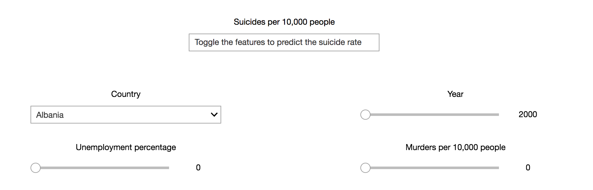

# Personal Data Science Project: Predicting Suicide Rates from their Supposed Risk Factors

To view the notebooks live, please click the binder button below
(NB by default, it opens in the current tab unless otherwise specified and it may take a couple of minutes to load):

After that, to use the app in which the trained random forest regressor model predicts the suicide rate to be for your own data, please navigate to the file called theAppInterface.ipynb and click on 'AppMode':

App preview:

To view and run the notebook which contains the data wrangling, exploration and training, please navigate to the file called predictingSuicides.ipynb

